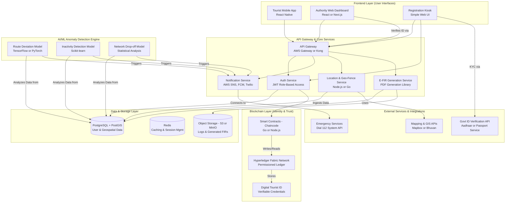
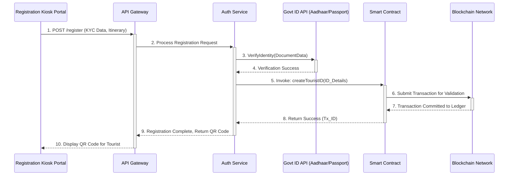
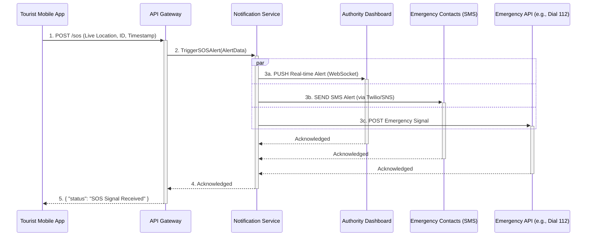
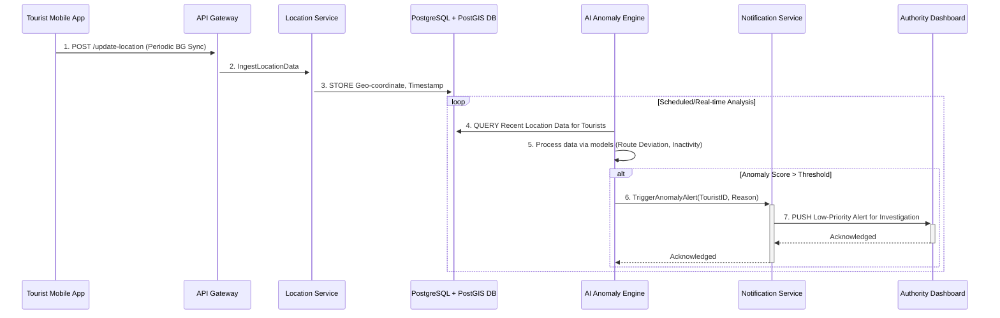
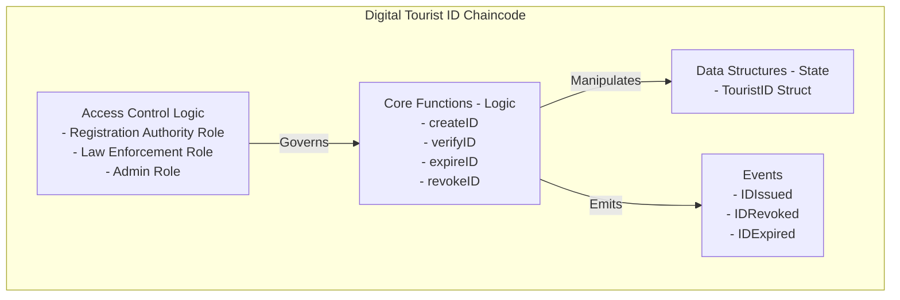
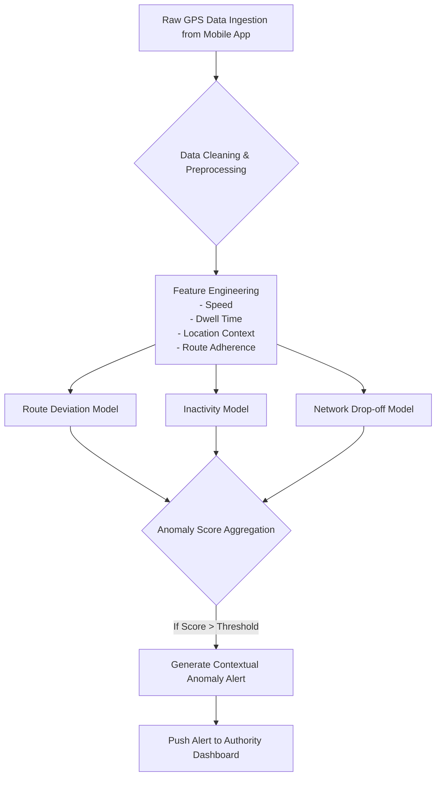
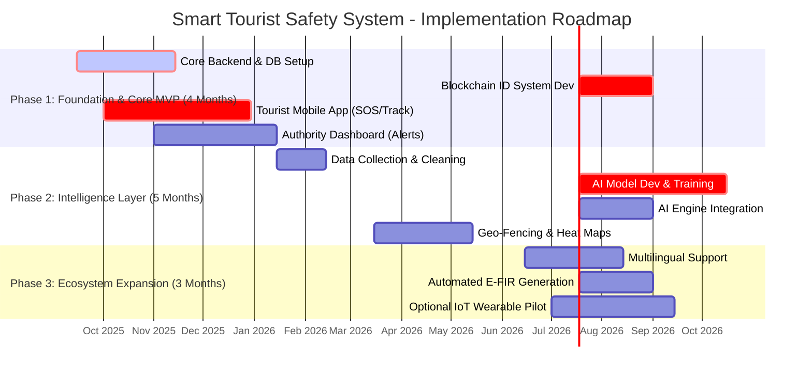
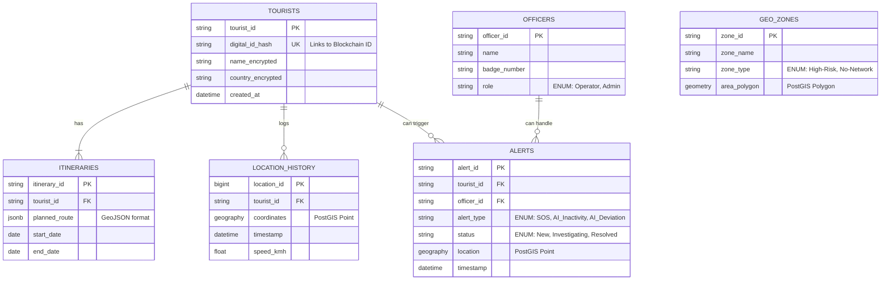
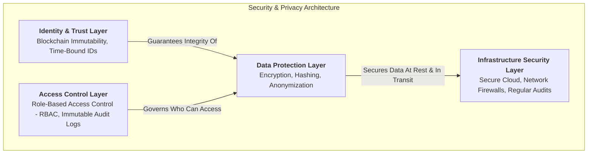

## 1. System Architecture Overview

## 1. High-Level System Architecture

## 2. Data Flow Pipeline

### 2. 1. Data Flow: Tourist Onboarding & Digital ID Generation

### 2. 2. Data Flow: SOS / Panic Button Incident Response

### 2. 3. Data Flow: Proactive AI Anomaly Detection

## 3. Smart Contract Architecture

## 4. AI Processing Pipeline

## 5. Implementation Pipeline & Phases

## 6. Data Structures & Database Schema

## 7. Security & Privacy Architecture

## 8. Technical Specifications

### Core Technologies Stack:

**Frontend:** React Native, Next.js (React)

**Backend:** Node.js, Go(Golang), Python(Flask/Django)

**Blockchain:** Hyperledger Fabric, Go or Node.js

**AI/ML:** Python, TensorFlow & PyTorch, Scikit-learn

**Infrastructure:** Cloud Platform (AWS, Azure, or NIC MeghRaj), Docker & Kubernetes, PostgreSQL with PostGIS, Redis

## **9. Key Features & Capabilities**

### **Advanced AI Features:** 🧠

* **Predictive Risk Assessment:** The system's AI doesn't just react; it proactively predicts risk by analyzing travel patterns against declared itineraries, location context, and normal tourist behavior. It can flag a tourist who is potentially in danger *before* they press the panic button.
* **Dynamic Safety Heat Maps:** The dashboard features a live map that shows real-time tourist clusters and dynamically updates "hot zones" based on incoming alerts, historical crime data, and AI-detected anomalies, allowing authorities to allocate resources more effectively.
* **Context-Aware Anomaly Detection:** The AI understands context. It can differentiate between a tourist stopping for two hours at a popular museum (normal behavior) and a tourist stopping for two hours on a remote, unlit highway at night (a high-risk anomaly), which significantly reduces false alarms.

---

### **Decentralized Benefits:** ⛓️

* **Tamper-Proof Digital Identity:** The core of the system's trust. The blockchain ensures that a tourist's Digital ID is **immutable**—it cannot be forged, altered, or deleted by anyone. This provides a single, verifiable source of truth for all law enforcement and government agencies.
* **Privacy by Design via Time-Bound IDs:** A critical privacy feature where the Digital ID automatically expires the moment the tourist's trip is over. This ensures their data isn't stored indefinitely and aligns with data protection principles like purpose limitation.
* **Inter-Agency Trust and Auditability:** Using a permissioned blockchain like **Hyperledger Fabric** allows different government bodies (e.g., Ministry of Tourism, State Police Departments) to operate on the same trusted ledger, ensuring seamless and auditable collaboration.

---

### **Scalability Features:** ⚙️

* **Microservices Architecture:** The system is built from independent services (Location, Notification, Auth). This means the location-tracking service can be scaled up during peak tourist season without affecting the rest of the system's performance.
* **Cloud-Native Deployment:** Using **Docker** and **Kubernetes**, the system can automatically scale its resources up or down based on demand. This is both cost-effective and ensures the system remains responsive even with hundreds of thousands of active users.
* **Asynchronous Processing:** Heavy computational tasks, like running AI analysis across thousands of data points, are handled in the background. This ensures that the critical user-facing elements, like the SOS button and the real-time alert dashboard, are always instantly responsive.

---

## **10. Success Metrics & KPIs**

### **User Engagement & Impact:** 📈

* **App Adoption Rate:** The percentage of tourists in a given region who successfully register and activate the app. This is the primary indicator of public trust and perceived value.
* **Incident Response Time Reduction:** The average time measured from an SOS alert being triggered to the first response arriving on the scene. The goal is a quantifiable reduction compared to pre-system benchmarks.
* **Successful AI-driven Interventions:** The number of verified incidents where an AI-generated anomaly alert (not an SOS) led to a successful intervention, directly proving the proactive capabilities of the system.

---

### **Technical Performance:** 📊

* **Alert Latency:** The end-to-end time from a tourist pressing the SOS button to the alert appearing on the authority dashboard. **Target: < 2 seconds.**
* **AI Model Accuracy:** The precision and recall rates of the anomaly detection engine, continuously measured to minimize false positives (unnecessary alerts) and eliminate false negatives (missed incidents).
* **System Uptime:** The percentage of time all critical system components are fully operational and available. **Target: > 99.95%.**
